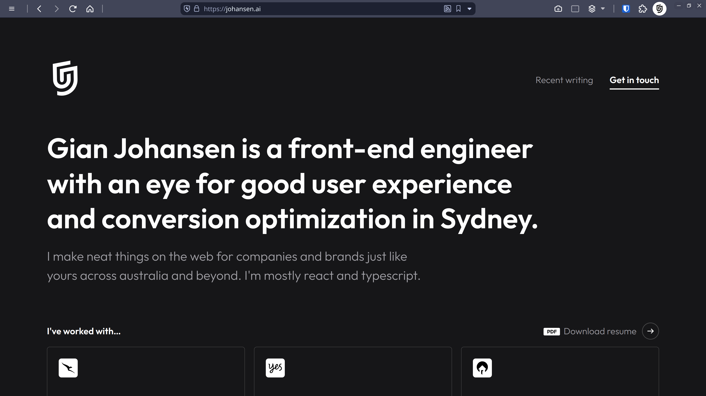

This is my personal website, built with next.js and deployed via Cloudflare.



Currently lives at [https://johansen.ai](https://johansen.ai/).

## Development

Run the development server:

```bash
npm run dev
# or
yarn dev
```

View at [http://localhost:3000](http://localhost:3000).

## Build

Build the artifact:

```bash
npm run build
# or
yarn build
```

(Optional) Serve locally:

```bash
npm run start
# or
yarn start
```

## Contributions

You can either open a pull request or click the edit button from within a post for content changes.

## History

Previous iterations:

**2018 - 2022** - Raindrop animation


